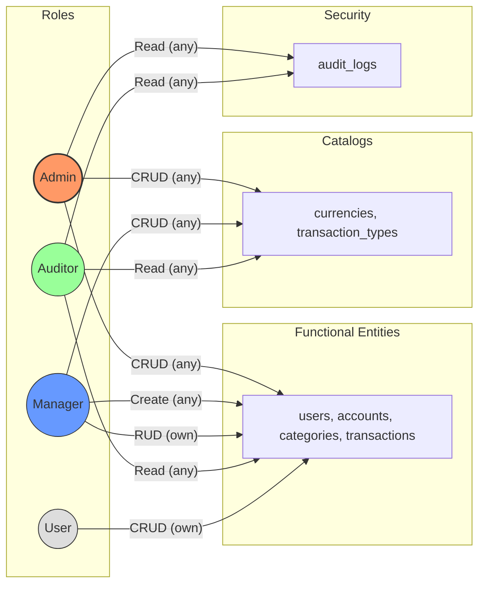

# Money Manager Backend

## Configuration

This service loads environment variables from env/.env

1. Create the environment file:

```bash
cp env/.env.example env/.env
```

2. Adjust the values for your environment:

| Variable | Usage | Default |
| --- | --- | --- |
| APP_HOST | Host/IP where the HTTP server listens | 127.0.0.1 |
| APP_PORT | HTTP server port | 8000 |
| DATABASE_URL | Database connection string ||
| JWT_SECRET | Secret used to sign/verify JWT | dev-secret |
| JWT_EXP_HOURS | JWT token expiration in hours | 24 |
| PASSWORD_RESET_EXP_MINUTES | Password reset token expiration in minutes | 30 |
| PASSWORD_RESET_URL_BASE | Public frontend base URL for password reset | empty |
| EMAIL_VERIFICATION_EXP_MINUTES | Email verification token expiration in minutes | 60 |
| EMAIL_VERIFICATION_URL_BASE | Public frontend URL for email verification | empty |

Optional variable:

- APP_ENV: environment value reported by the system endpoint (defaults to development).

## Migrations and Seeders

Schema migrations and seeders run separately.

Default seeded credentials

- admin / ContraseniaSegura2026!
- manager / ContraseniaSegura2026!
- auditor / ContraseniaSegura2026!
- default / ContraseniaSegura2026!

1. Apply migrations (table structure only):

```bash
cargo run --manifest-path migrations/Cargo.toml --bin migrate
```

2. Run seeders (initial data):

```bash
cargo run --manifest-path migrations/Cargo.toml --bin seed
```

## Deployment

### Development

```bash
cargo run
```

### Production

```bash
cargo build --release
./target/release/money_manager_backend
```

### Docker Compose with profiles

Start development environment (incremental compilation with cache volumes):

```bash
cd docker
docker compose --profile dev up -d --build
```

Start production environment (release build):

```bash
cd docker
docker compose --profile prod up -d --build
```

Note: use only one profile at a time to avoid port conflicts on `8000`.

Stop:

```bash
cd docker
docker compose --profile dev down
```

## Swagger / OpenAPI

The API exposes interactive documentation generated with utoipa.

- Swagger UI: http://localhost:8000/swagger/
- OpenAPI JSON specification: http://localhost:8000/api-docs/openapi.json

## Mailpit

For email testing and local development, you can access the Mailpit web interface to catch and view outgoing emails:

- Mailpit Dashboard: http://localhost:8025/

## Authorization and Roles

| Group | Resources |
| --- | --- |
| Functional Entities | users, accounts, categories, transactions |
| Catalogs | currencies, transaction_types |
| Security | audit_logs |

| Role | Functional Entities | Catalogs | Security |
| --- | --- | --- | --- |
| Admin | CRUD (any) | CRUD (any) | Read (any) |
| Manager | Create (any) + RUD (own) | CRUD (any) | - |
| Auditor | Read (any) | Read (any) | Read (any) |
| User | CRUD (own) | - | - |


