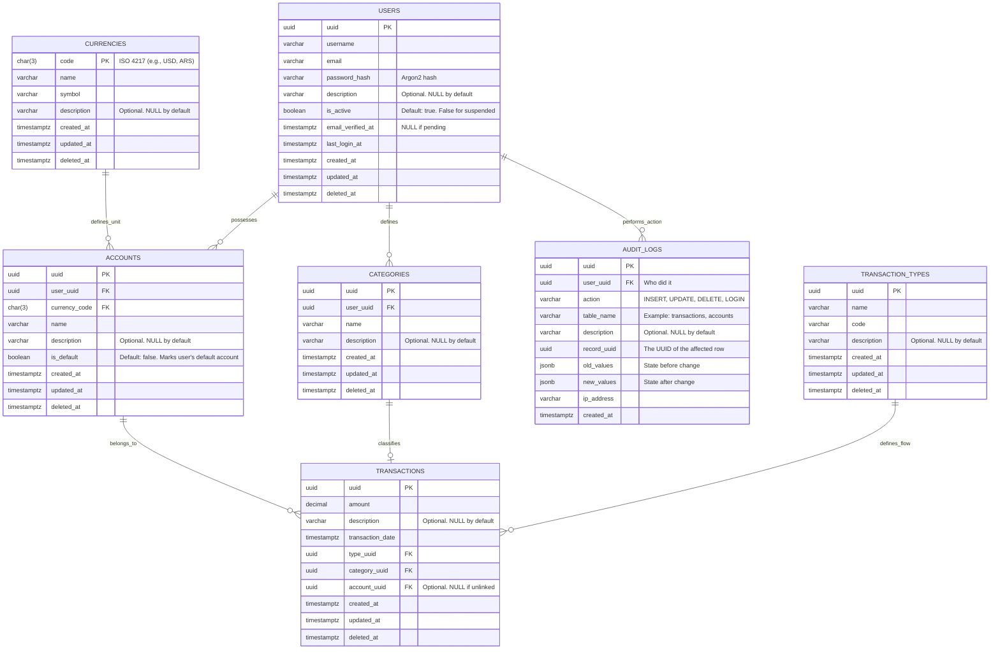

```mermaid
erDiagram
    USERS ||--o{ ACCOUNTS : "possesses"
    USERS ||--o{ CATEGORIES : "defines"
    USERS ||--o{ AUDIT_LOGS : "performs_action"
    ACCOUNTS ||--o{ TRANSACTIONS : "belongs_to"
    CATEGORIES ||--o| TRANSACTIONS : "classifies"
    TRANSACTION_TYPES ||--o{ TRANSACTIONS : "defines_flow"
    CURRENCIES ||--o{ ACCOUNTS : "defines_unit"

    USERS {
        uuid uuid PK
        varchar username
        varchar email
        varchar password_hash "Argon2 hash"
        varchar description "Optional. NULL by default"
        boolean is_active "Default: true. False for suspended"
        timestamptz email_verified_at "NULL if pending"
        timestamptz last_login_at
        timestamptz created_at
        timestamptz updated_at
        timestamptz deleted_at
    }

    CURRENCIES {
        char(3) code PK "ISO 4217 (e.g., USD, ARS)"
        varchar name
        varchar symbol
        varchar description "Optional. NULL by default"
        timestamptz created_at
        timestamptz updated_at
        timestamptz deleted_at
    }

    ACCOUNTS {
        uuid uuid PK
        uuid user_uuid FK
        char(3) currency_code FK
        varchar name
        varchar description "Optional. NULL by default"
        boolean is_default "Default: false. Marks user's default account"
        timestamptz created_at
        timestamptz updated_at
        timestamptz deleted_at
    }

    TRANSACTIONS {
        uuid uuid PK
        decimal amount
        varchar description "Optional. NULL by default"
        timestamptz transaction_date
        uuid type_uuid FK
        uuid category_uuid FK
        uuid account_uuid FK "Optional. NULL if unlinked"
        timestamptz created_at
        timestamptz updated_at
        timestamptz deleted_at
    }

    AUDIT_LOGS {
        uuid uuid PK
        uuid user_uuid FK "Who did it"
        varchar action "INSERT, UPDATE, DELETE, LOGIN"
        varchar table_name "Example: transactions, accounts"
        varchar description "Optional. NULL by default"
        uuid record_uuid "The UUID of the affected row"
        jsonb old_values "State before change"
        jsonb new_values "State after change"
        varchar ip_address
        timestamptz created_at
    }

    TRANSACTION_TYPES {
        uuid uuid PK
        varchar name
        varchar code
        varchar description "Optional. NULL by default"
        timestamptz created_at
        timestamptz updated_at
        timestamptz deleted_at
    }

    CATEGORIES {
        uuid uuid PK
        uuid user_uuid FK
        varchar name
        varchar description "Optional. NULL by default"
        timestamptz created_at
        timestamptz updated_at
        timestamptz deleted_at
    }
```